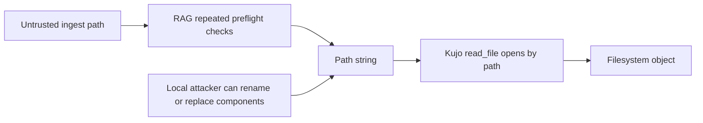
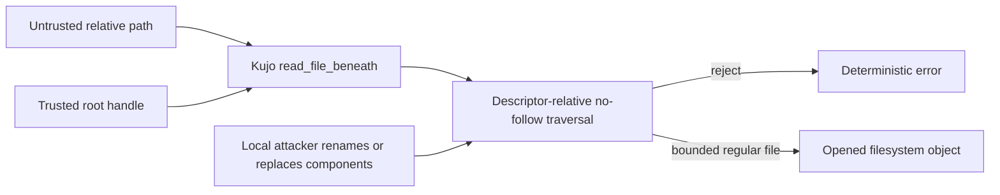

# Security Hardening Proposal: Descriptor-relative no-follow ingest reads

## Decision

Choose whether TM-05 remains a caller-owned sequence of path checks or becomes
a Kujo-owned filesystem capability that binds containment and opening into one
operation.

## Executive Recommendation

The complete option set is Option 1, **Repeated local guards**, and Option 2,
**Descriptor-relative capability read**. I recommend Option 2 under the current
security and compatibility constraints, introduced as a preview additive API
before RAG replaces its tactical checks.

## Evidence

| Evidence | Finding or document | What it establishes |
| --- | --- | --- |
| `E-TM` | RAG threat-model packet, TM-05 | RAG rechecks symlinks before parsing but records a remaining check/open race. |
| `E-KUJO-FS` | Kujo filesystem boundary sources | Kujo exposes bounded `read_file` and path inspection, but no descriptor-relative no-follow read contract. |

I inspected RAG's recorded residual and Kujo's filesystem dispatch. The observed
fact is that containment validation and the final open are separate operations.
We infer that a local actor able to replace a checked component can still race
the path string before the open; this proposal does not claim a demonstrated
production exploit.

## Current Design And Failure Mode

RAG accepts a path, validates its relationship to configured roots, inspects
symlink state, and later calls a generic Kujo read primitive. Those checks stop
ordinary traversal and static links. They do not pin the root or intermediate
directories, so the operating system resolves the final string against mutable
directory entries. Repeating the check narrows the timing window but does not
remove it.

## Desired Invariants

- The trusted root is opened once and cannot be replaced by pathname mutation.
- Every component is traversed relative to an already-open directory handle.
- Symlinks, Windows reparse points, absolute paths, prefixes, `.` and `..` are rejected.
- The final object is a regular file and is read with the existing 8 MiB ceiling or a lower caller ceiling.
- Unsupported platforms fail closed; they never fall back to check-then-open.
- VM and interpreter calls share one native implementation and error contract.

## Constraints And Non-Goals

The API must be additive, preserve current `read_file`, remain behind the
`filesystem-read` capability, and avoid extra full-file copies. It does not
protect against an attacker who can modify the already-open regular file's
contents, and it is not a general sandbox or write API.

## Before Architecture

The current flow leaves a mutable pathname between policy and effect.

Source: [before diagram](../diagrams/descriptor-relative-ingest-before.mmd).

## Options

### Option 1: Repeated local guards

We can retain the present API and add more `symlink_metadata` and canonical-path
checks immediately before every read. This is attractive because it is small,
portable, and has negligible steady-state memory cost. It also preserves the
race structurally: each successful check still yields a string that is resolved
again. It should remain as defense in depth during migration, but it is not a
sound closure condition for TM-05.

| Change | Before | After | Security consequence | Cost |
| --- | --- | --- | --- | --- |
| Check placement | Discovery and pre-parse | More pre-open checks | Narrows, but cannot close, the race | More filesystem metadata calls |
| API ownership | RAG callers | RAG callers | Future callers can drift | Low migration cost |

### Option 2: Descriptor-relative capability read

Kujo adds `read_file_beneath(root, relative_path, max_bytes)`. On Unix, the
implementation pins the root directory and traverses with `openat` plus
`O_NOFOLLOW`, `O_DIRECTORY`, and `O_CLOEXEC`, then `fstat`s and bounded-reads the
final descriptor. Linux may use `openat2` with `RESOLVE_BENEATH` and
`RESOLVE_NO_SYMLINKS` as an optimization, but the public semantics cannot depend
on it. Windows must use handle-relative traversal with reparse-point rejection;
if that mechanism cannot be supported safely, the call returns a stable
unsupported-platform error instead of weakening the invariant.

The strongest case for this option is ownership: the operation that opens the
file also proves how it was reached. The likely performance cost is one
descriptor open per component, which we expect to be modest for shallow ingest
paths but have not measured. Handles are closed as traversal advances, so
memory remains bounded. Rollback is simple while the API is preview: RAG can
return to its tactical checks without removing the additive runtime primitive.

| Change | Before | After | Security consequence | Cost |
| --- | --- | --- | --- | --- |
| Root identity | Re-resolved path | Pinned directory handle | Root replacement cannot redirect traversal | One root open |
| Component traversal | Pathname resolution | No-follow handle-relative opens | Symlink/reparse and rename substitution fail closed | One open per component |
| Control owner | Every RAG caller | Kujo filesystem boundary | Less policy drift | Public API and platform work |

## Comparison

| Dimension | Option 1: local guards | Option 2: capability read |
| --- | --- | --- |
| Security | Improves timing resistance; race remains | Removes pathname check/open race within the supported OS contract |
| Performance | Near-neutral; extra metadata calls | Additional component opens; benchmark required |
| Memory | Neutral and bounded | Neutral and bounded handle set |
| Reliability | Familiar errors; possible race ambiguity | Deterministic rejection; platform implementation risk |
| Operability | No new surface | New error codes and unsupported-platform telemetry |
| Migration | Immediate and compatible | Additive preview API, then caller migration |

All effects are source-derived except Windows mechanism feasibility and measured
latency, which remain hypothetical. Benchmarks must compare 1-, 5-, and
20-component paths across small and 8 MiB files, with p50/p95 time and open-file
counts reported.

## Recommendation

I recommend Option 2 because it makes the desired invariant enforceable by one
owned boundary. Option 1 becomes preferable only as a temporary measure or if a
supported platform cannot provide handle-relative no-follow semantics and the
project accepts documenting TM-05 as unresolved there.

## Evidence Coverage And Residual Risk

| Evidence | Effect | Tactical fix still required | Residual risk |
| --- | --- | --- | --- |
| `E-TM` — TM-05 path race | Addresses on supported platforms | Yes, until all ingest callers migrate | In-place modification of an opened file is outside this contract |
| `E-KUJO-FS` — missing owned primitive | Addresses | Existing generic API remains for compatibility | New callers may still choose the generic API unless lint/docs guide them |

## Migration And Rollout

Ship the runtime API as preview, migrate one RAG parser path, run parity and race
stress tests, then migrate remaining ingest paths. Promote to stable only after
Windows and Unix conformance pass. Roll back caller adoption first; keep the
additive API until the next normal deprecation window.

## Validation Plan

Test valid files, final and intermediate symlinks, reparse points, absolute and
parent traversal, directories and devices, root replacement, concurrent rename
stress, max-size plus one byte, invalid UTF-8, VM/interpreter parity, capability
denial, and descriptor cleanup. Benchmark the path depths and file sizes above.

## Implementation Work Packages

- Define the API, stable error codes, capability mapping, and preview docs.
- Implement Unix and Windows handle-relative backends without a weak fallback.
- Add native, VM/interpreter, and race-stress conformance tests.
- Migrate RAG discovery and parse reads while retaining tactical checks.
- Add a lint or review rule for security-sensitive ingest callers.

## Open Questions

- Should the first API return bytes only, with UTF-8 decoding kept at the caller?
- Which Windows primitive and minimum supported version satisfy handle-relative traversal?
- Should the root handle be reusable in a future scoped filesystem capability object?

