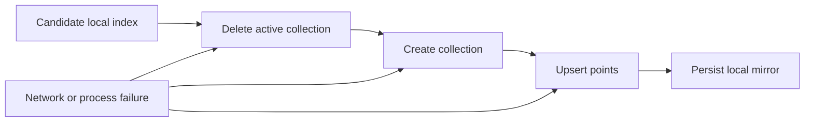
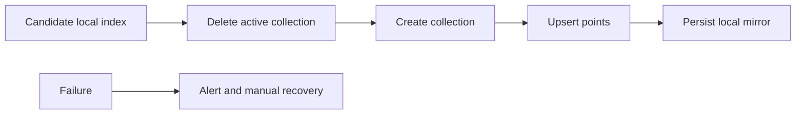
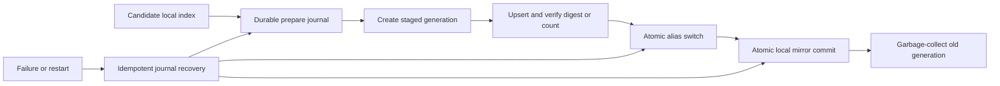

# Security Hardening Proposal: Recoverable Qdrant commit protocol

## Decision

Choose whether Qdrant synchronization may continue replacing the active
collection destructively or must stage a new generation and commit it through
an atomic alias with durable recovery state.

## Executive Recommendation

The complete option set is Option 1, **Destructive replacement with stronger
alerts**, and Option 2, **Staged generation and atomic alias commit**. I
recommend Option 2 for strict mode. Option 1 may remain available only as a
clearly labeled compatibility mode outside strict production.

## Evidence

| Evidence | Finding or document | What it establishes |
| --- | --- | --- |
| `E-TM` | RAG threat-model packet, TM-07 | Local and Qdrant writes are not transactional and require recovery design. |
| `E-QSRC` | Qdrant synchronization implementation | The active collection is deleted before create and upsert, while the local mirror is saved last. |
| `E-QDOC` | Qdrant backend contract | The documented contract describes authoritative destructive replacement and fail-open/closed modes. |
| `E-QTEST` | Qdrant security regression | Failure coverage proves the prior local mirror survives, but does not prove the remote collection survives. |

I inspected the call order and its test. The observed failure window begins once
the active collection is deleted and ends only after remote upsert and local
atomic persistence. We infer that a network failure, crash, or rejected payload
inside that window can leave queries empty or divergent even when the save
returns false.

## Current Design And Failure Mode

`qdrant_sync_index` deletes the named collection, recreates it, and upserts all
points. `qdrant_save` then persists the local mirror. This order makes deletion
semantics simple, but “fail closed” describes the return value, not restoration
of remote state. Retrying can recover if the candidate index is still available;
the system does not currently persist enough transaction state to guarantee
that recovery after restart.

## Desired Invariants

- The currently queryable generation remains intact until a complete candidate is verified.
- A single atomic operation selects the active remote generation.
- Every candidate has a unique transaction ID, content digest, vector count, and state journal.
- Restart recovery is idempotent for prepare, remote stage, alias commit, local commit, and cleanup states.
- A reported successful save has matching committed local and remote generation metadata.
- Privacy deletion commits an intentionally empty generation or an explicit empty alias state; it never relies on deleting active data first.
- Old generations are garbage-collected only after a retention window and successful commit verification.

## Constraints And Non-Goals

Local JSON and memory backends remain unchanged. The protocol must not place API
keys in process arguments, must preserve HTTPS and host allowlisting, and must
bound journals and staged generations. It is not a distributed transaction
across arbitrary vector databases; this contract targets Qdrant alias semantics.

## Before Architecture

The active remote state is destroyed before the replacement is known good.

Source: [before diagram](../diagrams/qdrant-recoverable-commit-before.mmd).

## Options

### Option 1: Destructive replacement with stronger alerts

We can retain the current order, persist the candidate before remote mutation,
and add explicit retry and divergence alerts. This is the smallest compatibility
change and keeps collection naming stable. Its strongest case is operational
simplicity for small, non-critical deployments. What gives me pause is that an
alert cannot restore the deleted collection, so availability and deletion
correctness still depend on a successful retry.

| Change | Before | After | Security consequence | Cost |
| --- | --- | --- | --- | --- |
| Candidate retention | In-memory call input | Durable retry candidate | Improves recoverability | Extra disk write |
| Failure response | False return | False return plus alert/retry | Detects divergence sooner | Monitoring and retry worker |
| Active collection | Deleted first | Deleted first | Destructive window remains | No migration |

### Option 2: Staged generation and atomic alias commit

We create a generation collection named from a bounded transaction ID, upload
the candidate without touching the active alias, and verify count plus a
deterministic digest marker. A single Qdrant alias update switches the stable
logical name to the new generation. A bounded local journal records each phase;
after the alias commit, local atomic persistence records the same generation and
digest. Startup recovery compares journal, local metadata, and alias target to
complete or roll back the unfinished phase. Old collections drain for a
configured retention window before garbage collection.

This design removes the destructive availability window and gives recovery an
explicit state machine. It adds remote storage during staging, an alias lookup
on recovery, and operational cleanup. Query latency should remain neutral after
commit because callers use the stable alias; ingestion latency increases by
verification work, which is off the query path. Empty indexes require an
explicit configured vector dimension or a committed prior dimension so an
empty staged collection can be created safely.

| Change | Before | After | Security consequence | Cost |
| --- | --- | --- | --- | --- |
| Remote update | Delete active first | Build isolated generation | Active data survives failed staging | Temporary duplicate storage |
| Commit point | Multi-call sequence | Atomic alias update | Queryable state changes once | Alias support and recovery logic |
| Recovery | Caller retry | Durable idempotent journal | Restart can reconcile divergence | Journal schema and operator tooling |
| Cleanup | Immediate delete | Delayed generation GC | Rollback remains possible | Storage budget and retention policy |

## Comparison

| Dimension | Option 1: destructive plus alerts | Option 2: staged alias commit |
| --- | --- | --- |
| Security | Mitigates silent failure; destructive window remains | Removes destructive pre-commit window and makes state transitions auditable |
| Performance | Extra local write and retry work | Ingest verification and temporary duplicate upload; query path neutral |
| Memory | Neutral if serialization remains streamed/bounded | Neutral memory; increased temporary remote storage |
| Reliability | Better detection, manual recovery | Idempotent restart recovery and fast alias rollback |
| Operability | Alerts and retry queue | Journals, generation inventory, GC, and alias observability |
| Migration | Low | New config, alias bootstrap, and one-time collection adoption |

These assessments are source-derived except resource magnitude and Qdrant
service behavior under load, which are hypothetical. A live container and
staging benchmark must measure ingest wall time, uploaded bytes, temporary
storage, query latency through the alias, and recovery duration under injected
failures.

## Recommendation

I recommend Option 2 for strict mode because it gives us a real commit point and
a testable recovery state machine. Option 1 remains proportionate for local
development or a backend explicitly configured as non-authoritative, but it
must not be represented as transactional or fail-safe.

## Evidence Coverage And Residual Risk

| Evidence | Effect | Tactical fix still required | Residual risk |
| --- | --- | --- | --- |
| `E-TM` — TM-07 transaction residual | Addresses for Qdrant alias deployments | Preserve HTTPS, allowlist, secret handling, and failure propagation | Qdrant service compromise remains out of scope |
| `E-QSRC` — destructive ordering | Addresses | Keep legacy path only outside strict mode during migration | Alias API bugs or operator deletion can still cause loss |
| `E-QTEST` — local-only preservation proof | Addresses coverage gap | Retain existing test and add remote-state assertions | Fake transport cannot replace live Qdrant validation |

## Migration And Rollout

Introduce the protocol behind `staged_alias` consistency mode. Bootstrap an
alias to the existing collection without data movement, then use generation
commits for new writes. Keep the previous generation until verification and the
retention window complete. Rollback switches the alias to the prior verified
generation and reconciles the local mirror from its retained candidate.

## Validation Plan

Add fake-transport state-machine tests for every failure edge and a live Qdrant
container suite covering create, upsert, verify, atomic alias switch, empty
commit, restart after each phase, idempotent retry, rollback, and delayed GC.
Assert that active remote data and the prior local mirror remain readable after
every pre-commit failure. Benchmark representative 1k, 100k, and maximum
supported point sets without inventing promotion thresholds before measurement.

## Implementation Work Packages

- Freeze journal schema, transaction IDs, generation names, and recovery states.
- Add configured/derived vector dimensions and alias bootstrap validation.
- Implement staged create, upload, digest/count verification, and atomic alias update.
- Implement atomic local commit, startup reconciliation, rollback, and bounded GC.
- Add fake and live Qdrant fault-injection coverage plus operator runbooks.
- Require `staged_alias` in strict mode after a compatibility release.

## Open Questions

- Which Qdrant versions and alias operations are the minimum supported contract?
- Should local commit follow alias commit, or should queries validate journal state until both agree?
- What retention window and storage ceiling should gate old-generation GC?
- How should an intentionally empty index obtain its vector dimension on first deployment?

